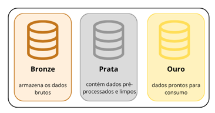

# sql-data-warehouse-project
Construindo um Data Warehouse moderno com SQL Server, incluindo os processos de ETL, modelagem de dados e análises.

Este projeto é uma solução de Data Warehouse e Analytics, desde a sua construção até a geração de informações prontas para uso por analistas e gestores. Foi projetado como um projeto de portfólio e apresenta as melhores práticas da engenharia de dados e analytics.

---

## 🏗️ Arquitetura de Dados

A arquitetura de dados deste projeto segue a Arquitetura Medalhão com camadas Bronze, Prata e Ouro.



**Camada Bronze:** Armazena os dados brutos exatamente como vêm dos sistemas de origem. Os dados são ingeridos a partir de arquivos CSV para o banco de dados.
**Camada Prata:** Esta camada inclui processos de limpeza, padronização e normalização dos dados para prepará-los para análise.
**Camada Ouro:** Armazena os dados prontos para uso, modelados no esquema estrela (star schema) necessário para relatórios e analytics.

---

## 📖 Visão Geral do Projeto

Este projeto envolve:

- **Arquitetura de Dados:** Projeto de um Data Warehouse moderno utilizando a Arquitetura Medalhão com camadas Bronze, Prata e Ouro.
- **Pipelines de ETL:** Extração, transformação e carga de dados dos sistemas de origem para o data warehouse.
- **Modelagem de Dados:** Desenvolvimento de tabelas fato e dimensão otimizadas para consultas analíticas.
- **Analytics e Relatórios:** Criação de relatórios e dashboards baseados em SQL para insights acionáveis.


🎯 Este projeto demonstra conhecimento em:
 
- Desenvolvimento SQL
- Arquitetura de Dados
- Engenharia de Dados
- Desenvolvimento de Pipelines de ETL
- Modelagem de Dados
- Data Analytics

---

## 🚀 Requisitos do Projeto
 
### Construindo o Data Warehouse (Engenharia de Dados)
 
**Objetivo**
 
Desenvolver um data warehouse moderno usando SQL Server para consolidar dados de vendas, possibilitando relatórios analíticos e tomada de decisão baseada em dados.
 
**Especificações**
 
- **Fontes de Dados:** Importar dados de dois sistemas de origem (ERP e CRM) fornecidos como arquivos CSV.
- **Qualidade de Dados:** Limpar e resolver problemas de qualidade de dados antes da análise.
- **Integração:** Combinar as duas fontes em um único modelo de dados, de fácil uso, projetado para consultas analíticas.
- **Escopo:** Focar apenas no conjunto de dados mais recentes; a historização dos dados não é necessária.
- **Documentação:** Fornecer documentação clara do modelo de dados para apoiar tanto as áreas de negócio quanto as equipes de dados.

---
 
### BI: Analytics e Relatórios (Análise de Dados)
 
**Objetivo**
 
Desenvolver análises baseadas em SQL para fornecer insights detalhados sobre:
 
- Comportamento do Cliente
- Desempenho de Produtos
- Tendências de Vendas
Esses insights capacitam os gerentes com indicadores de negócio, possibilitando decisões estratégicas.
 
## 📂 Estrutura do Repositório
 
```
sql-data-warehouse-project/
│
├── datasets/                           # Datasets usados no projeto (dados de ERP e CRM)
│
├── docs/                               # Documentação do projeto e detalhes da arquitetura
│   ├── data_architecture.png           # Arquivo png com a arquitetura do projeto
│   ├── data_catalog.md                 # Catálogo de datasets, incluindo descrições de campos e metadados
│   ├── data_flow.png                   # Arquivo png com o diagrama de fluxo de dados
│   ├── data_models.png                 # Arquivo png com os modelos de dados (esquema estrela)
│   ├── data_integration.png            # Arquivo png com os relacionamentos entre as tabelas
│   ├── naming-conventions.md           # Diretrizes de nomenclatura consistente para tabelas, colunas e arquivos
│
├── scripts/                            # Scripts SQL para ETL e transformações
│   ├── bronze/                         # Scripts para extração e carga de dados brutos
│   ├── silver/                         # Scripts para limpeza e transformação de dados
│   ├── gold/                           # Scripts para criação de modelos analíticos
│
├── tests/                              # Scripts de teste e arquivos de qualidade
│
├── README.md                           # Visão geral do projeto e instruções
└── LICENSE                             # Informações de licença do repositório
```

---

## 👦🏻 Sobre Mim

Me chamo Rodrigo Ferraz. Sou um profissional na área de dados, formado em Administração e cursando Sistemas de Informação.
Meu objetivo profissional é evoluir para posições de liderança, atuando como engenheiro de dados capaz de conectar estratégia de negócio e tecnologia, liderar equipes técnicas, estruturar processos de governança de dados e apoiar a transformação digital das empresas por meio de decisões baseadas em dados.


